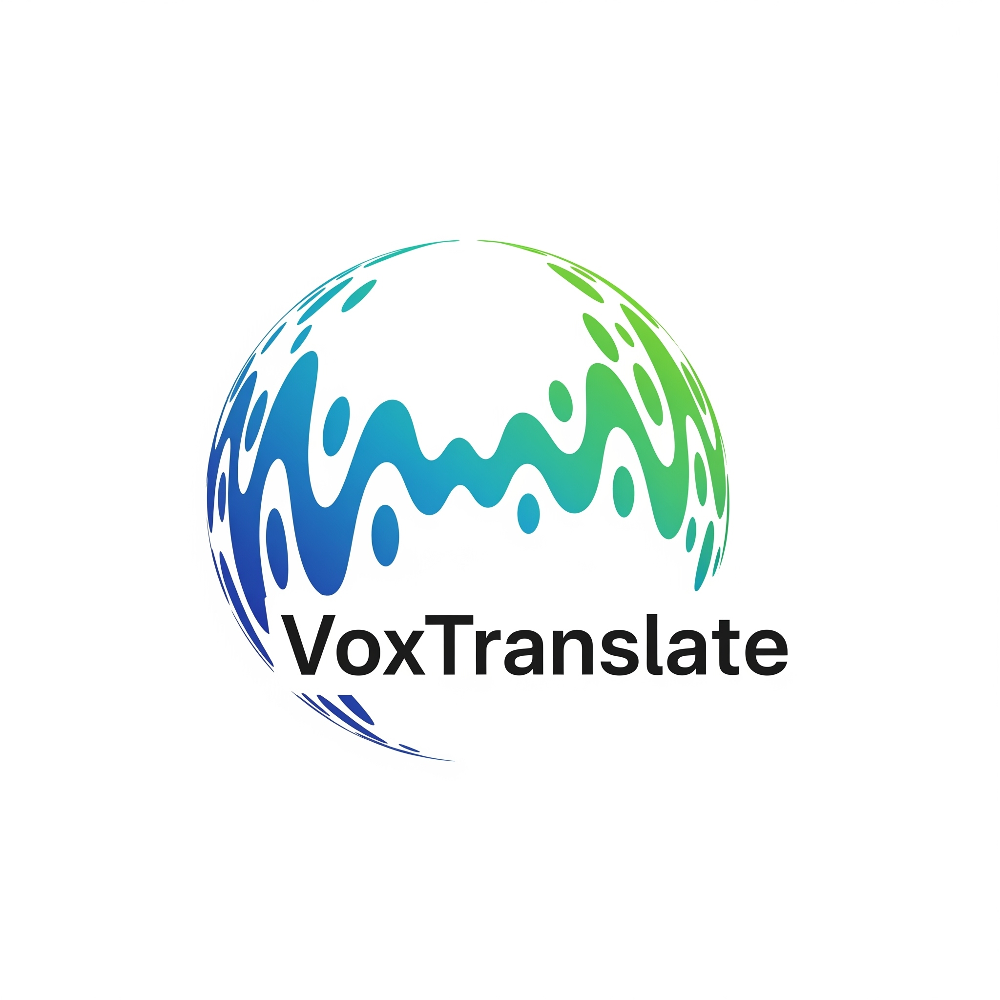

# VoxTranslate 🎤

<p align="center">
  
</p>

<h3 align="center">Real-time Voice Translator and Transcriber</h3>

<p align="center">
  Break down language barriers during conversations, lectures, and meetings with simultaneous translation and transcription, directly from your microphone.
</p>

<p align="center">
  
  
  
</p>

<p align="center">
  <a href="#-features">Features</a> •
  <a href="#-tech-stack">Tech Stack</a> •
  <a href="#-getting-started">Getting Started</a> •
  <a href="#-usage">Usage</a> •
  <a href="#-contributing">Contributing</a>
</p>

<p align="center">
  
</p>

## ✨ Features

- **Real-time Translation**: Speak in one language and see the translation appear on the screen instantly.
- **Simultaneous Transcription**: Use it in transcription mode to convert your speech into text in the same language, ideal for dictating notes or generating captions.
- **Voice Activity Detection (VAD)**: Utilizes Silero VAD to process audio only when speech is detected, saving computational resources.
- **Multi-language Support**: Easily configure the source and target languages through a user-friendly interface.
- **Advanced Configuration**: Adjust VAD parameters (sensitivity, silence duration, etc.) through a settings window to adapt the application to different environments (quiet or noisy).

## 🚀 Tech Stack

This project is built with the following cutting-edge technologies:

- **Python 3**
- **Whisper (OpenAI)**: For high-accuracy Automatic Speech Recognition (ASR).
- **Helsinki-NLP**: Opus-MT series models for fast and efficient Machine Translation (MT).
- **Silero VAD**: For Voice Activity Detection.
- **PyTorch**: As the backbone for running all AI models.
- **PyAudio**: For real-time audio capture from the microphone.
- **Tkinter**: For building the Graphical User Interface (GUI).

## 🔧 Getting Started

To get a local copy up and running, follow these steps.

### Prerequisites

- Python 3.8 or higher.
- `pip` and `venv` for package and environment management.
- **For Linux users**: The `portaudio` library is required for `PyAudio` to work.
  ```sh
  sudo apt-get install portaudio19-dev
  ```
- **For macOS users**: You can install `portaudio` using Homebrew.
  ```sh
  brew install portaudio
  ```

### Installation Steps

1.  **Clone the repository:**

    ```sh
    git clone [https://github.com/YOUR-USERNAME/VoxTranslate.git](https://github.com/YOUR-USERNAME/VoxTranslate.git)
    cd VoxTranslate
    ```

    _(Replace `YOUR-USERNAME` with your GitHub username)_

2.  **Create and activate a virtual environment:**

    ```sh
    # For Windows
    python -m venv venv
    .\venv\Scripts\activate

    # For macOS/Linux
    python3 -m venv venv
    source venv/bin/activate
    ```

3.  **Install dependencies:**

    ```sh
    pip install -r requirements.txt
    ```

4.  **Run the application:**
    ```sh
    python main.py
    ```
    The first run might take a bit longer as the AI models are downloaded.

## 👨‍💻 Usage

1.  **Start the program**: Run `python main.py`.
2.  **Select the languages**:
    - To **translate**, choose different languages in the "From:" and "To:" menus.
    - To **transcribe**, choose the same language in both menus.
3.  **Click "Start"**: The program will begin listening to the microphone.
4.  **Speak**: The translated/transcribed text will appear on the screen.
5.  **Click "Pause"** to stop the process.

## 🤝 Contributing

Contributions are what make the open-source community such an amazing place to learn, inspire, and create. Any contributions you make are **greatly appreciated**.

1.  Fork the Project.
2.  Create your Feature Branch (`git checkout -b feature/AmazingFeature`).
3.  Commit your Changes (`git commit -m 'Add some AmazingFeature'`).
4.  Push to the Branch (`git push origin feature/AmazingFeature`).
5.  Open a Pull Request.

## 📄 License

Distributed under the MIT License. See `LICENSE` for more information.

## 🙏 Acknowledgments

- [OpenAI](https://openai.com/) for the Whisper model.
- [Helsinki-NLP](https://github.com/Helsinki-NLP) for the excellent translation models.
- The [Silero](https://github.com/snakers4/silero-vad) community for the VAD model.
